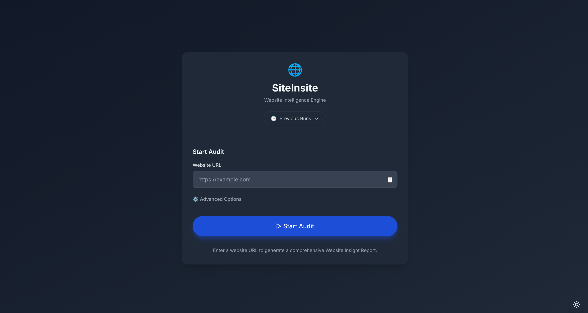
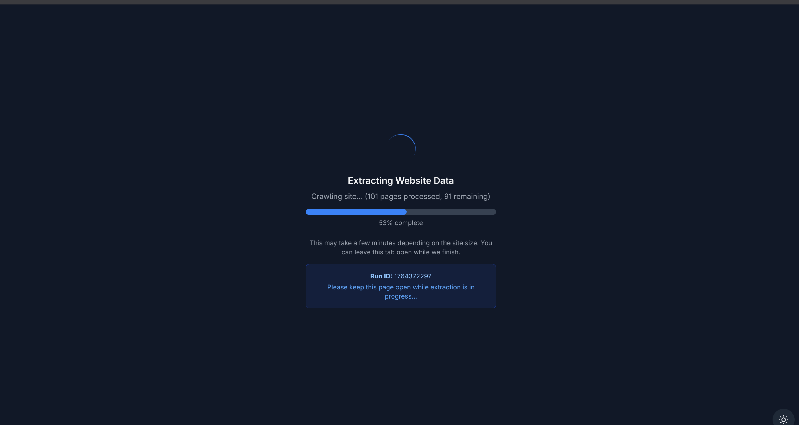
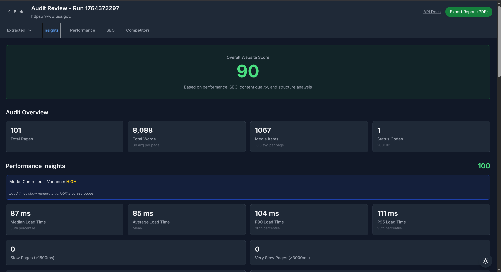
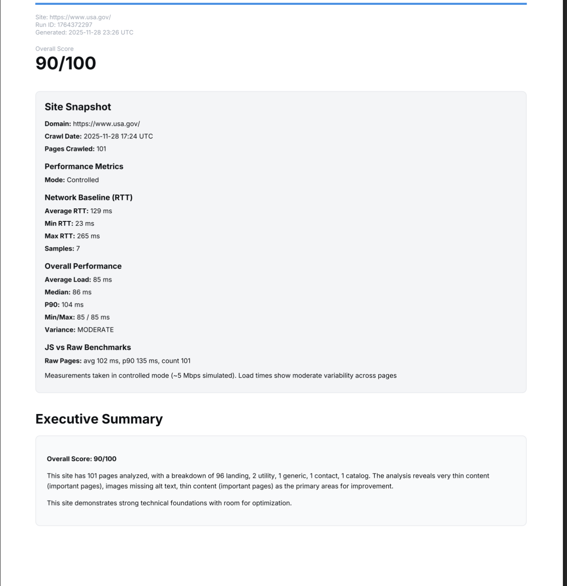

# SiteInsite

A full-stack website intelligence platform that crawls websites, extracts content, and generates comprehensive insight reports covering SEO, performance, content quality, and competitor analysis.

## Overview

SiteInsite is a production-ready web application built with FastAPI and React that performs deep website analysis. It crawls sites respecting robots.txt, extracts content from multiple formats (HTML, PDF, DOCX, JSON, CSV), analyzes SEO metrics, measures performance, and generates actionable reports.



## How It Works

### System Architecture

The application follows a microservices-inspired architecture with clear separation between crawling, extraction, analysis, and presentation layers.

```
┌─────────────────┐
│   React UI      │  ← Real-time progress, interactive reports
└────────┬────────┘
         │ HTTP/REST
┌────────▼─────────────────────────────────────┐
│         FastAPI Backend                       │
│  ┌────────────────────────────────────────┐  │
│  │  Crawl Engine                          │  │
│  │  • Async HTTP client (aiohttp)        │  │
│  │  • URL frontier with deduplication    │  │
│  │  • Rate limiting & politeness         │  │
│  │  • JavaScript rendering (Playwright)  │  │
│  └──────────────┬─────────────────────────┘  │
│                 │                             │
│  ┌──────────────▼─────────────────────────┐  │
│  │  Content Extractors                    │  │
│  │  • HTML (BeautifulSoup + trafilatura)   │  │
│  │  • PDF (PyPDF2, pdfminer)              │  │
│  │  • DOCX (python-docx)                  │  │
│  │  • Multiprocessing for CPU-bound tasks │  │
│  └──────────────┬─────────────────────────┘  │
│                 │                             │
│  ┌──────────────▼─────────────────────────┐  │
│  │  Analysis Engine                       │  │
│  │  • SEO keyword extraction & scoring   │  │
│  │  • Performance metrics aggregation     │  │
│  │  • Content quality analysis            │  │
│  │  • Competitor comparison               │  │
│  └──────────────┬─────────────────────────┘  │
│                 │                             │
│  ┌──────────────▼─────────────────────────┐  │
│  │  Storage Layer                         │  │
│  │  • JSON-based file storage            │  │
│  │  • SimHash deduplication              │  │
│  │  • Async I/O operations               │  │
│  └────────────────────────────────────────┘  │
└─────────────────────────────────────────────┘
```

### Data Flow

1. **Crawl Initiation**: User submits URL → FastAPI endpoint → `RunManager` creates crawl state
2. **URL Discovery**: `Frontier` manages URL queue with depth tracking and domain filtering
3. **Content Fetching**: `Fetcher` uses async semaphores for concurrent requests with rate limiting
4. **Content Extraction**: Type-specific extractors process content using multiprocessing for CPU-bound tasks
5. **Analysis**: Extracted data flows through analysis modules (SEO, performance, content quality)
6. **Storage**: Results stored as JSON with async file I/O for performance
7. **Reporting**: Analysis results aggregated into insight reports with PDF export capability

### Key Technical Components

#### Crawling Engine

- **Async HTTP Client**: Built on `aiohttp` with configurable concurrency limits
- **URL Frontier**: Implements breadth-first crawling with depth limits and domain filtering
- **Rate Limiting**: Per-host rate limiting to respect server resources
- **Robots.txt Compliance**: Parses and respects robots.txt rules
- **Bot Avoidance**: Configurable strategies including header randomization and request timing

#### Content Extraction

- **HTML Processing**: Uses `readability-lxml` and `trafilatura` for clean text extraction
- **Multiprocessing**: CPU-bound extraction tasks run in process pool for parallelization
- **Format Support**: Handles HTML, PDF, DOCX, JSON, CSV, and images
- **Deduplication**: SimHash algorithm for near-duplicate content detection

#### SEO Analysis

- **Keyword Discovery**: N-gram extraction and frequency analysis to identify focus keywords
- **Keyword Scoring**: Multi-factor scoring including:
  - Coverage score (keyword usage across pages)
  - On-page score (title, headings, URL, anchor text usage)
  - Density score (keyword frequency within pages)
- **SEO Health**: Analyzes meta tags, heading structure, alt text, and structured data

#### Performance Analysis

- **Load Time Metrics**: Tracks TTFB, total load time, and content size
- **Statistical Analysis**: Computes average, median, P90, P95 percentiles
- **Bandwidth Simulation**: Controlled mode with simulated throttling for consistent testing
- **Consistency Analysis**: Identifies performance stability issues across multiple samples

#### Competitor Comparison

- **Parallel Auditing**: Runs multiple site audits concurrently
- **Metric Comparison**: Side-by-side comparison of scores, performance, content, and SEO
- **Opportunity Identification**: Generates actionable insights on competitive gaps

## Tech Stack

**Backend:**
- Python 3.10+ with type hints throughout
- FastAPI for async API endpoints
- aiohttp for async HTTP client
- BeautifulSoup4 for HTML parsing
- trafilatura & readability for content extraction
- Playwright for JavaScript rendering (optional)
- SimHash for deduplication
- Multiprocessing for CPU-bound parallelization

**Frontend:**
- React 18 with TypeScript
- Vite for fast builds
- Tailwind CSS for styling
- React Router for navigation

**Infrastructure:**
- Docker for containerization
- Async file I/O for performance
- JSON-based storage for simplicity

## Features

- **Intelligent Crawling**: Async concurrent crawling with rate limiting and robots.txt compliance
- **Multi-Format Support**: Extracts content from HTML, PDF, DOCX, JSON, CSV, and images
- **SEO Analysis**: Keyword discovery, coverage scoring, and SEO health metrics
- **Performance Metrics**: Load time tracking, statistical analysis, and consistency measurement
- **Competitor Comparison**: Side-by-side benchmarking with actionable insights
- **Real-Time Progress**: WebSocket-like polling for live crawl progress
- **PDF Reports**: Professional PDF export with charts and recommendations
- **Modern UI**: Responsive React interface with dark mode support


*Real-time crawl progress monitoring*

## Quick Start

### Prerequisites

- **Python 3.10+** (check with `python --version` or `python3 --version`)
- **Node.js 18+** (check with `node --version`)
- **Git** (for cloning the repository)

### Option 1: One-Command Setup (Recommended)

The easiest way to run SiteInsite is using the provided development script:

```bash
# From the project root directory
python scripts/dev.py
```

This script will:
1. Create a Python virtual environment (`.venv`) if it doesn't exist
2. Install all backend dependencies
3. Install all frontend dependencies
4. Start both the backend and frontend servers

Once running, access:
- **Frontend UI**: http://localhost:5173
- **Backend API**: http://localhost:5051
- **API Documentation**: http://localhost:5051/docs

Press `Ctrl+C` to stop both servers.

### Option 2: Manual Setup

If you prefer to run the servers separately:

**1. Setup Backend:**

```bash
# Navigate to backend directory
cd backend

# Install Python dependencies
pip install -r requirements.txt

# Start the FastAPI server
uvicorn backend.app:app --reload --port 5051
```

**2. Setup Frontend (in a new terminal):**

```bash
# Navigate to frontend directory
cd frontend

# Install Node.js dependencies (first time only)
npm install

# Start the development server
npm run dev
```

### Option 3: Docker

If you have Docker installed:

```bash
# Build and start both services
docker-compose up --build

# Or run in detached mode
docker-compose up -d --build
```

Access the application at http://localhost:5173

### First Run

1. Open http://localhost:5173 in your browser
2. Enter a website URL (e.g., `https://example.com`)
3. Click "Start Audit" to begin crawling
4. Monitor progress in real-time
5. View insights once crawling completes


*Comprehensive insight reports with SEO, performance, and content analysis*

### Troubleshooting

**Port already in use:**
- Backend default port: 5051
- Frontend default port: 5173
- Change ports in `scripts/dev.py` or use environment variables

**Python dependencies fail to install:**
- Ensure you have Python 3.10+ installed
- On Linux, you may need: `sudo apt-get install python3-dev` or `sudo dnf install python3-devel`

**Node.js dependencies fail:**
- Ensure you have Node.js 18+ installed
- Try deleting `node_modules` and running `npm install` again

**Backend won't start:**
- Check that port 5051 is available
- Verify Python dependencies are installed: `pip list`

**Frontend won't start:**
- Check that port 5173 is available
- Verify Node.js dependencies: `npm list`

## Configuration

Copy `env.example` to `.env`:

- `GLOBAL_CONCURRENCY`: Concurrent requests (default: 12)
- `PER_HOST_LIMIT`: Requests per host (default: 6)
- `REQUEST_TIMEOUT_SEC`: Request timeout (default: 20)
- `MAX_PAGES_DEFAULT`: Page limit (default: 400)
- `RENDER_ENABLED`: Enable JavaScript rendering (default: false)
- `PERF_MODE`: Performance mode - controlled, realistic, stress (default: controlled)
- `USE_MULTIPROCESSING`: Use multiprocessing for extraction (default: true)

## API Endpoints

**Run Management:**
- `POST /api/runs/start` - Start new audit
- `GET /api/runs/{run_id}/progress` - Get progress
- `POST /api/runs/{run_id}/stop` - Stop audit

**Pages:**
- `GET /api/pages/{run_id}` - List pages with filtering
- `GET /api/pages/{run_id}/{page_id}` - Get page details

**Insights:**
- `GET /api/insights/{run_id}/summary` - Get insight report
- `GET /api/insights/{run_id}/seo_keywords` - Get SEO analysis
- `GET /api/insights/{run_id}/export` - Export PDF report


*Professional PDF export with detailed insights and recommendations*

**Comparison:**
- `GET /api/competitors/suggest` - Get competitor suggestions
- `POST /api/compare` - Run competitor comparison

Full API documentation available at `/docs` when running.

## Code Quality

- **Python**: Type hints, comprehensive docstrings, PEP 8 compliance
- **TypeScript**: Strict mode, full type coverage
- **Architecture**: Clean separation of concerns, dependency injection
- **Error Handling**: Comprehensive error handling and validation
- **Testing**: Unit tests for critical components

## Project Structure

```
SiteInsite/
├── backend/
│   ├── app.py              # FastAPI application
│   ├── routers/            # API route handlers
│   ├── crawl/              # Crawling engine
│   ├── extract/            # Content extractors
│   ├── insights/           # Analysis modules
│   └── storage/            # Data persistence
├── frontend/
│   ├── src/
│   │   ├── pages/          # Page components
│   │   ├── components/     # Reusable components
│   │   └── lib/           # Utilities and types
│   └── package.json
├── scripts/                # Development scripts
└── docker-compose.yml      # Docker configuration
```

## License

Copyright (c) 2025 Nicholas Burgo & Andrew Ponder. All Rights Reserved.

This software and associated documentation files are the confidential and proprietary property of Nicholas Burgo & Andrew Ponder.

Unauthorized use or reproduction of this software, in any form, is strictly prohibited.
